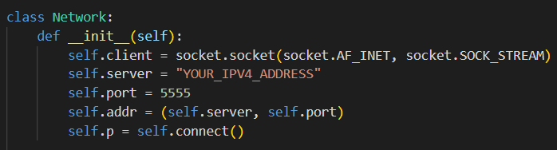

# Networking example for game development

### How to run

1. Install the necessary dependencies (preferably on a virtual environment):
```
(your_env) $ pip install pygame 
```
2. Before running the necessary scripts, change the IP ADDRESS on both files server.py...


and network.py:


The IP can be found with the following command:

3. Run the server script:
```
(your_env) $ python server.py
```
4. Run the first client on a terminal (or cmd):
```
(your_env) $ python client.py
```
5. Run the second client on another terminal (or cmd):
```
(your_env) $ python client.py
```

You should see two game windows, each one for a client:


Try to move a square from each window and see the results!
